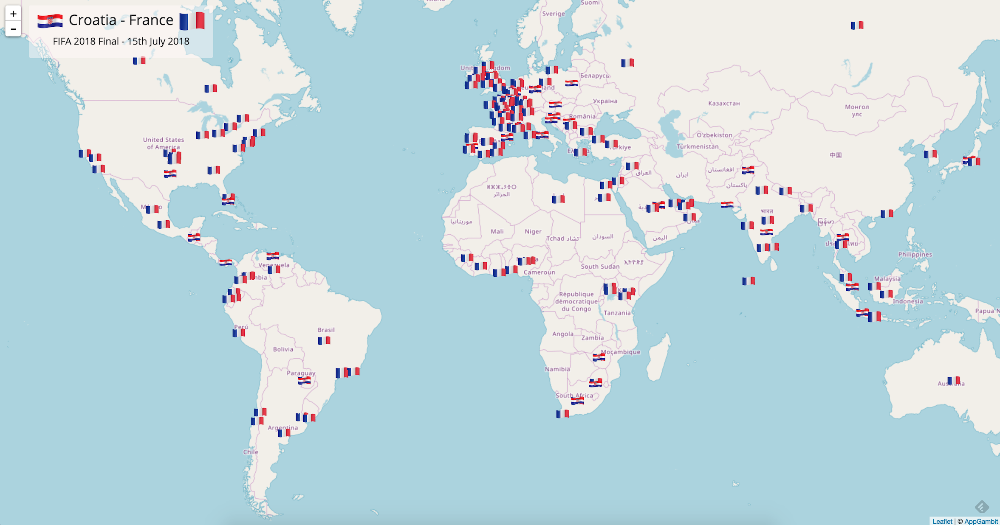

# And France Won FIFA 2018 World Cup Russia 🎉 🙌 🙌 🎉

# Server side
* Update `config.json` with your keys
* `yarn install`
* `yarn start`

# Client side
* Update ScaleDrone Key in script.js
* Upload updated file on S3.

# GeoLocation 
Some of the tweets are not carrying Geo location value, but they have the location value. So I am using Google Geo Service to convert the location to Lat/Lng value. As those values remain same every time, I do not contact Google to convert the same location twice, instead keep a local file `location.json'` which stores all the Location-to-Geo values for future purpose.

